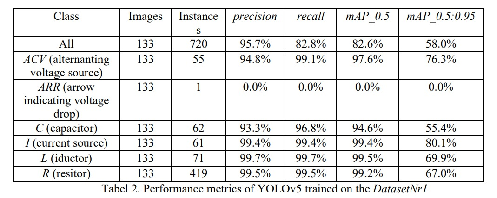
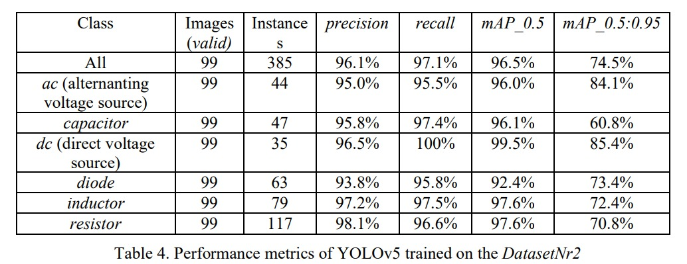
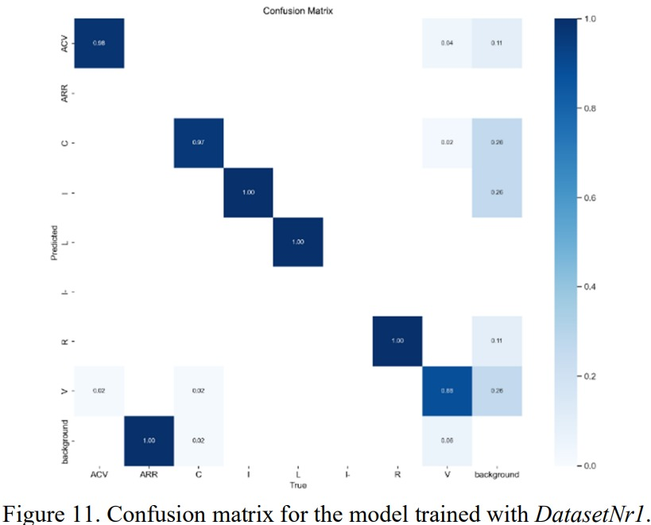
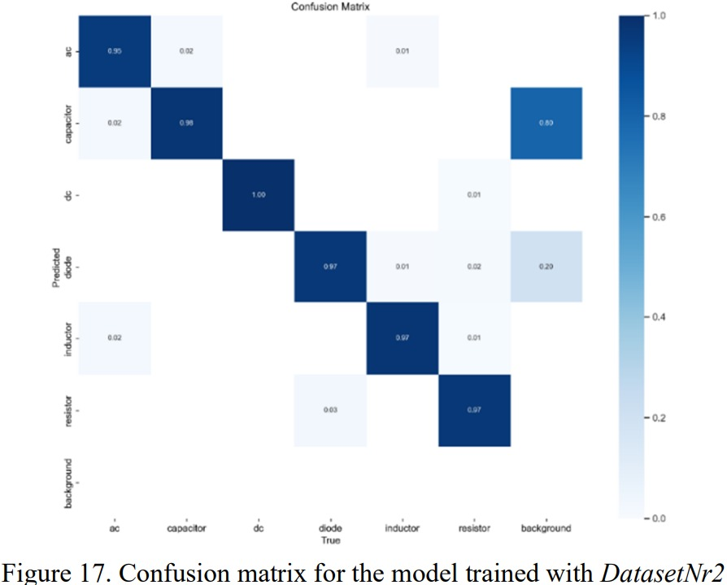
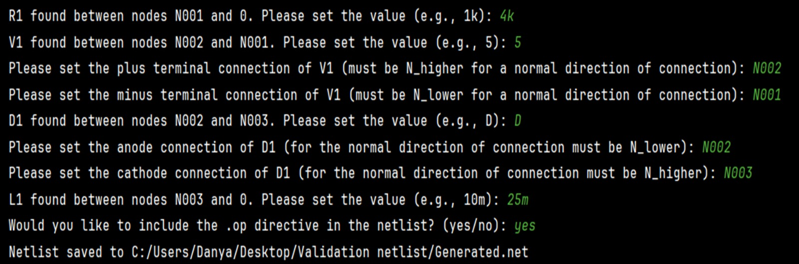
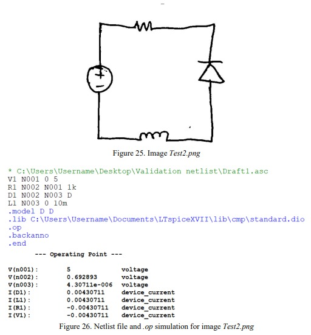

**Bachelor's Thesis : "Generation of SPICE netlist files using neural networks"**  
University: Technical University of Cluj-Napoca  
Program: Bachelor's Degree in Electronics and Telecommunications  
Author: Daniil Zabunov  
Year: 2024  

# English Summary of the Project

## 1.1 State of the Art

Artificial intelligence (AI) in computer science focuses on creating systems and algorithms to 
perform tasks requiring human intelligence, such as learning, reasoning, and pattern recognition. 
The work aims to develop an automated system for recognizing and converting electronic 
circuit components from images into files compatible with the LTSpice application. This involves 
training a YOLOv5 model for accurate detection of components in images and developing an 
algorithm to translate these detections into a format usable in LTSpice. The primary objective is to 
fully automate the generation of SPICE netlist files, reducing the time and effort required to 
transform graphical documentation into functional models.

### 1.1.1 Machine Learning

Machine Learning is a subfield of AI that involves developing algorithms that allow computers 
to learn from and make predictions or decisions based on data. Rather than being explicitly 
programmed to perform a task, a machine learning model learns patterns from data, enabling it to 
improve its performance over time. ML is used in various applications, such as recommendation 
systems, fraud detection, and predictive analytics.

### 1.1.2 Deep Learning

Deep Learning (DL) is a specialized subset of machine learning that focuses on using neural 
networks with many layers. These deep neural networks can model complex patterns in large 
datasets and are particularly effective for tasks such as image and speech recognition, natural 
language processing, and autonomous driving. DL models require large amounts of data and 
computational power to train effectively.

### 1.1.3 Neural Networks

Neural Networks (NN) are a core technology in deep learning and machine learning. Inspired 
by the human brain, NN consist of interconnected layers of nodes (also called neurons) that process 
data in a hierarchical manner. Each neuron takes input, processes it using a mathematical function, 
and passes the output to the next layer. NN are highly versatile and can be used for a wide range of
tasks, including classification, regression, and pattern recognition.
The perceptron is the simplest type of neural network and serves as the foundation for more 
complex networks. It consists of a single layer of neurons and can be used for binary classification
tasks. The perceptron receives multiple inputs, applies weightsto each input, sums them, and passes 
the result through an activation function to produce an output. If the output is above a certain 
threshold, the perceptron classifies the input into one category; otherwise, it classifies it into 
another.

### 1.1.4 Layers of an Neural Network

Neural networks are composed of multiple layers, each with a specific function within the 
overall structure. The first layer, known as the input layer, is where the raw data is initially received. 
In this layer, each neuron corresponds to a specific feature of the input data. Following the input 
layer are the hidden layers, which are positioned between the input and output layers. These hidden 
layers are responsible for performing intermediate computations. Each hidden layer typically 
applies a nonlinear activation function to the data, enabling the network to capture and model more 
intricate patterns.

## 1.2 Theoretical Fundamentals

### 1.2.1 YOLOv5 model

YOLOv5 (You Only Look Once version 5) is part of the YOLO family, known for its speed 
and efficiency in detecting objects in real-time. YOLOv5 frames object detection as a single 
regression problem, directly predicting bounding boxes and class probabilities from images in a 
single network pass. This architecture makes YOLOv5 incredibly fast and suitable for real-time 
applications.

### 1.2.2 Faster R-CNN model

Faster R-CNN (Region-based Convolutional Neural Networks) is a two-stage object detection 
framework. It first generates region proposals using a Region Proposal Network (RPN) and then 
refines these proposals and classifies objects in the second stage. Faster R-CNN is known for its 
high accuracy but is generally slower than YOLO models due to its more complex architecture.

### 1.2.3 Arguments for using YOLOv5

### 1.2.4 Necessary notions and concepts for using YOLOv5

YOLOv5 is designed to be extremely fast, making it ideal for processing large datasets quickly. 
This is particularly advantageous when real-time detection is required or when working with large scale datasets where training time is a critical factor. The single-stage architecture of this model 
allows for end-to-end training, simplifying the process and reducing the complexity compared to 
Faster R-CNN, which involves multiple stages.

### 1.2.5 Data Input

When working with the model, data input begins with providing the model with annotated 
images that include both the images themselves and labels specifying the objects' classes and 
bounding boxes. These annotations are essential as they guide the model in learning to identify and 
locate objects within images. The dataset is typically organized into three subdirectories: train, 
valid, and test. Before this data can be used for training, it undergoes preprocessing.

### 1.2.6 Data Preprocessing

Preprocessing includes resizing images to a consistent size, typically 640x640 pixels, to ensure 
uniformity across the dataset. Additionally, pixel values are normalized, often scaled to a range 
between 0 and 1, which helps stabilize the training process and speeds up learning. Data 
augmentation techniques such as flipping, scaling, rotation, and color adjustments are also applied 
to increase the diversity of the training data, which in turn enhances the model's ability to generalize 
to new, unseen data. During this step, the bounding boxes are also adjusted to ensure they correctly 
correspond to the objects after resizing.

### 1.2.7 Forward Propagation

In the forward propagation phase, the input image passes through the network layers, where 
various filters and operations are applied to detect features and predict bounding boxes and class 
probabilities. YOLOv5’s architecture, composed of convolutional layers, works by extracting 
features from the input image, then applying these features to predict potential bounding boxes for 
objects. Each bounding box is associated with a class label and a confidence score, which indicates 
the likelihood that the detected object belongs to a certain class.

### 1.2.8 Backward Propagation

Backward propagation is the process by which model learns by adjusting its weights based on 
the error between the predicted outputs and the actual annotations. The loss function, which 
combines localization loss, classification loss, and confidence loss, is calculated to measure how 
far off the predictions are from the actual labels. Gradients of this loss function are then computed 
with respect to the model's parameters, indicating how the weights need to be adjusted to reduce 
the error. These weights are updated using an optimization algorithm like Stochastic Gradient 
Descent (SGD) or Adam, iterating through this process across many batches of data until the 
model's performance converges.

### 1.2.9 Training Process

The training process involves initializing the model's weights, often using pre-trained weights
from a previous model to accelerate learning and improve performance. The training dataset is 
processed in batches, with the model refining its weights through forward and backward 
propagation in each batch. This process is repeated across multiple epochs, where the entire dataset 
is passed through the network several times to allow the model to learn effectively. After each 
epoch, the model's performance is evaluated on a separate validation dataset to ensure that it is not 
overfitting and to allow for any necessary adjustments to hyperparameters.

### 1.2.10 Model Evaluation

Evaluating the model involves testing its performance on a dataset it has not seen during 
training. The mean average precision (mAP) metric is commonly used to assess accuracy, 
considering both precision and recall across different intersection-over-union (IoU) thresholds. 
Precision measures how many of the objects identified by the model are correctly detected, 
while recall measures how many of the actual objects in the image the model successfully identifies.
Recall is a key metric used to evaluate the performance of a model, particularly in classification 
and object detection tasks. It measures the proportion of actual positive instances that the model 
correctly identifies. In other words, recall quantifies the model's ability to detect all relevant 
instances in the data.

### 1.2.11 Monitoring durring training

During training, it is important to monitor the model's performance to avoid underfitting and 
overfitting. Underfitting occurs when the model is too simple to capture patterns in the data, leading 
to poor performance on both training and validation sets. Overfitting arises when the model 
becomes overly complex, memorizing the training data and thus performing poorly on unseen data. 
To mitigate overfitting, Dropout and L2 regularization are commonly employed.

## 1.3 Implementation

### 1.3.1 Working environment

To set up the necessary dependencies for YOLOv5, the process begins with the installation of 
Python 3.8, ensuring compatibility with the required deep learning libraries. Following this, 
Anaconda is installed to facilitate the management of isolated environments, which is important
for avoiding conflicts between different project dependencies. A dedicated virtual environment 
named Yolov5Train_3.8 is then created using Anaconda, ensuring a clean and organized 
workspace for the project.With the environment in place, Git is installed to handle version control 
and enable the cloning of the YOLOv5 repository from GitHub. The next step involves installing 
all required Python dependencies specified in the requirements.txt file within the repository.

### 1.3.2 Training a YOLOv5 model

The project was initially created in PyCharm with the name YoloV5Train. A script named 
train_yolov5.py was developed to facilitate the training of the YOLOv5 model. This script was 
integrated with TensorBoard to allow real-time visualization of training metrics.
TensorBoard provides a comprehensive interface to monitor various performance indicators, 
such as loss, accuracy, and other relevant metrics during the training process. This integration was
particularly useful for implementing early stopping techniques, which help to prevent overfitting 
by halting the training process when the model's performance on the validation set no longer 
improves.

### 1.3.3 Model training and evaluation with DatasetNr1

The dataset contains 1,284 images and is organized into three subdirectories: train - a 
subdirectory used for training the model, valid - a validation subdirectory used during training to 
prevent overfitting, and test - a subdirectory used to evaluate the model after training is successfully 
completed. 
Each of these subdirectories contains an images folder with JPG images and a labels folder 
with TXT files that include information about the classes of electronic components and their 
bounding boxes. For training with DatasetNr1, real-time visualization of performance metrics was 
utilized by integrating TensorBoard and running the training process from the Anaconda Prompt.

### 1.3.4 Visualization of the model's performance metrics

The performance metrics of YOLOv5 trained on the DatasetNr1 are represented in the Table 2.

### 1.3.5 Model training and evaluation with DatasetNr2

In the study, two datasets were used, with the first being unsuitable for the initial goal of 
generating NET files for LTspice from hand-sketched electronic circuit images. Consequently, the 
YOLOv5 model was also trained on DatasetNr2, which includes 2,703 images of hand-drawn 
electronic circuits. Like the first dataset, DatasetNr2 is structured into train, valid, and test 
subdirectories for training, validation, and model evaluation. The performance metrics of YOLOv5 
trained on the DatasetNr1 are represented in the Table 4.

The results from training with DatasetNr1 and DatasetNr2 were compared, and it was decided 
to use the model trained with DatasetNr2 in the application, as it demonstrated better performance 
metrics. The final model utilized the best.pt file, which contains the neural weights obtained from 
the training with DatasetNr2.

### 1.3.6 Generating the LTspice netlist

In the project YoloV5Train, a script named generate_netlist.py was created to generate LTspice 
netlists for images included in DatasetNr2. Using the predictions from the YOLO model, functions 
for recognition, classification, and mapping of electronic components were integrated to generate 
a NET file compatible with LTspice. The script is fully functional and adheres to the netlisting 
rules of LTspice.

## 1.4 Experimental Results

The experimental results obtained from testing the YOLOv5 model for generating LTspice 
netlist files were presented using two distinct datasets, DatasetNr1 and DatasetNr2. These results 
included various metrics and visualizations, such as confusion matrices, precision-confidence
curves, recall-confidence curves, class distribution and bounding box analysis which provided 
insights into the model's performance in detecting and classifying electronic circuit components 
from images.

### 1.4.1 Evaluation of the results for DatasetNr1

The model trained on DatasetNr1 demonstrated varying performance across different classes 
of electronic components. Overall, the model achieved an average precision of 95.7% and a recall 
of 82.8%, with a mAP_0.5 of 82.6% and a mAP_0.5:0.95 of 58.0%. 
However, the model struggled with the ARR class (voltage drop indicator), where it failed to 
detect any instances, likely due to the limited representation of this class in the validation set. 
Despite this, the model showed excellent performance for other classes such as ACV (AC voltage 
source), L (inductor), and R (resistor), with near-perfect precision and recall, indicating its strong 
ability to accurately recognize components in diverse contexts. Overall, while the model shows 
promise, it is not fully optimized for the application due to its inconsistencies with certain classes.
The confusion matrix for the model trained with DatasetNr1 is represented in Figure 11.

### 1.4.2 Evaluation of the results for DatasetNr2

The YOLOv5 model trained on DatasetNr2 demonstrated strong performance, achieving an 
mAP_0.5 of 96.5%, indicating high precision in detecting electronic circuit components. While 
most classes performed well, the diode class exhibited slightly lower accuracy, likely due to 
dataset limitations. Recommendations for improving the model include rebalancing the dataset, 
enhancing labeling, and incorporating SPICE model names and component specifications to 
further automate the application. The confusion matrix for the model trained with DatasetNr2 is 
represented in Figure 17.

### 1.4.3 The functionality of the generate_netlist.py script

To validate the LTspice netlist generation script, a set of test images from the validation subset 
of DatasetNr2 was used. The script accurately maps electronic components detected by YOLOv5 
into LTspice-compatible NET files, adhering to netlisting rules. 
Additionally, the script includes functionality for assigning standard component values, 
enabling automatic DC operating point simulations in LTspice. This functionality was further 
enhanced by adding directives and specifying library paths to ensure accurate simulation results.
An example of the functionality of the generate_netlist.py file can be seen in Figures 25. and 26.

## 1.5 Conclusions

The work presents a solution for recognizing electronic components in circuits using CNNs, 
aiming to automate and speed up circuit design and simulation. The application generates netlist 
files directly from images, reducing manual effort.YOLOv5 was employed to identify components 
and their positions within circuits. The model was trained and evaluated using precision, recall, and 
mAP metrics, with Python used for implementation and LTspice for netlist generation.
The prototype struggles with distinguishing similar components and recognizing terminals, 
which impacts simulation realism and accuracy.Future improvements could include adapting the 
model for new circuit types, enhancing terminal recognition, and integrating detailed LTspice data 
for better netlist generation.

